<!--### Hi there 👋

**felipe-b-oliveira/felipe-b-oliveira** is a ✨ _special_ ✨ repository because its `README.md` (this file) appears on your GitHub profile.

Here are some ideas to get you started:

- 🔭 I’m currently working on ...
- 🌱 I’m currently learning ...
- 👯 I’m looking to collaborate on ...
- 🤔 I’m looking for help with ...
- 💬 Ask me about ...
- 📫 How to reach me: ...
- 😄 Pronouns: ...
- ⚡ Fun fact: ...
-->

<h1 align="left">Hi! 👋</h1>

###

  <!---->

  

    I'm Felipe, i'm a full stack developer. I'm currently based on Rio de Janeiro, and working on some personal projects. I'm a curious, design and technology lover, i have three years of experience working with web development having worked on projects with Javascript, Typescript and C# with React, NodeJS and .NET environments.
  

###

<h2 align="left">Contact</h2>

📫  You can contact me through the means below.

  

###

<h2 align="left">Stats</h2>

